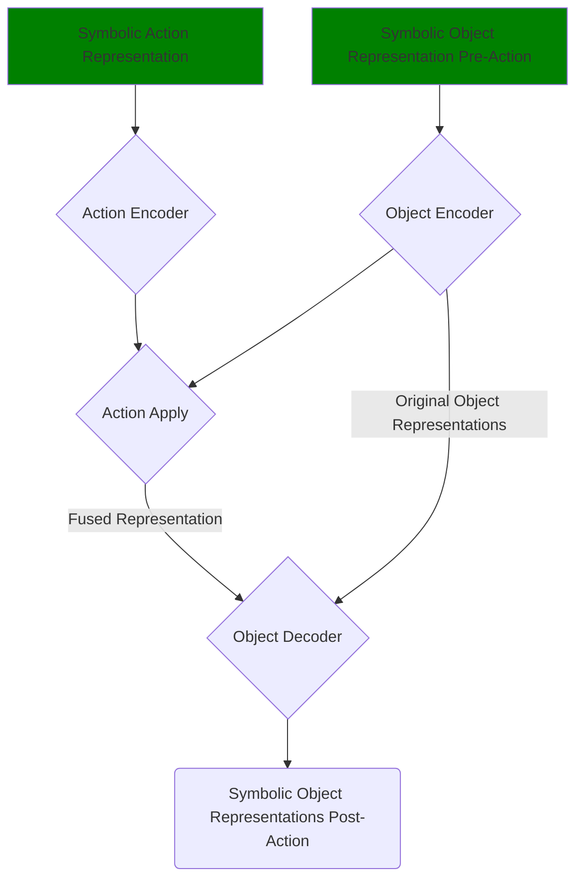
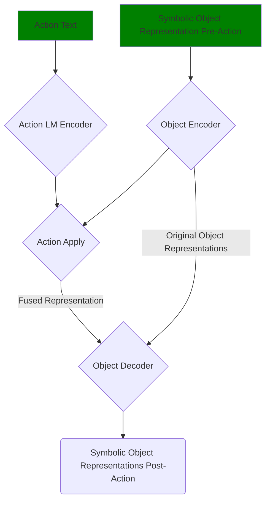
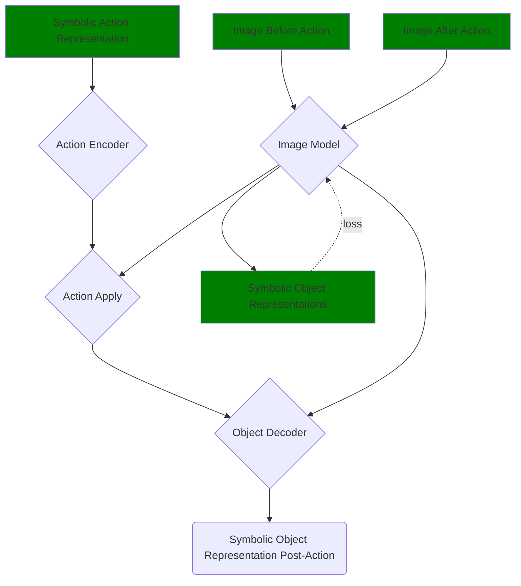
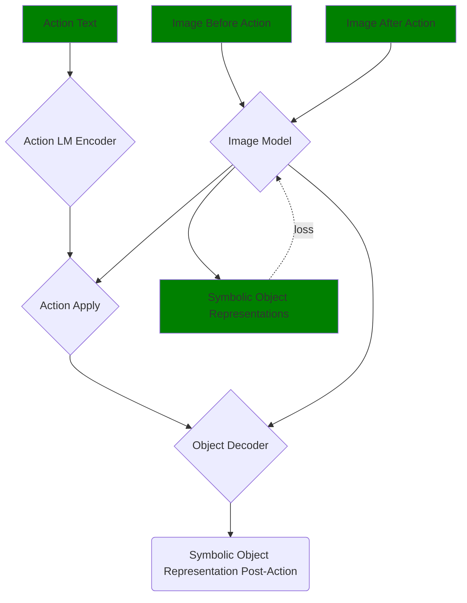

# Original Piglet Paper Architecture (NLU Task)

## During Pre-Training Phase

## During Fine-Tuning Phase (Annotated Dataset)

# Our Approach (NLU + Scene Comprehension)

## During Pre-Training Phase

## During Fine-Tuning Phase

